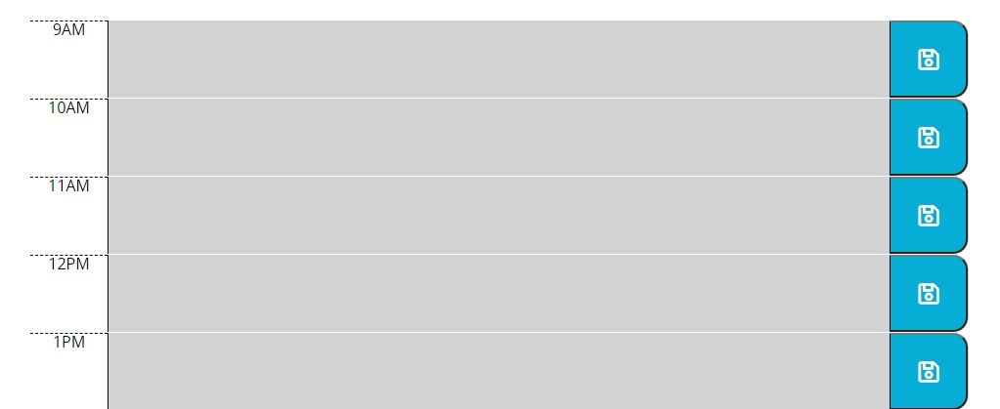
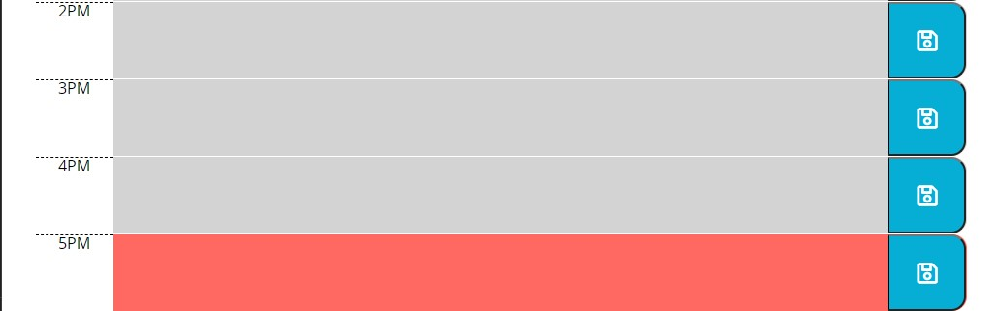

#Homework 05 Third-Party APIs: Work Day Scheduler

### Overview:
This is the fifth homework that is required for the University of Denver Coding Boot Camp.  The assignment was to build a sample calendar application that allows a user to save events for each hour of the day.

#### Code: 
The website is built using the following:
1. HTML, CSS & JavaScript
2. jQuery
3. Bootstrap 

#### Links:

- [Link to the Work Day Scheduler](https://markraud.github.io/hw-05-third-party-apis-work-day-scheduler).

- [Link to GitHub Repository](https://github.com/markraud/hw-05-third-party-apis-work-day-scheduler).

#### Screenshots of the quiz:

#### Summary:
This homework taught me about traversing the DOM along with inserting HTML elements and text.  I also learned how to build and style a webpage using the Bootstrap framework.
  
